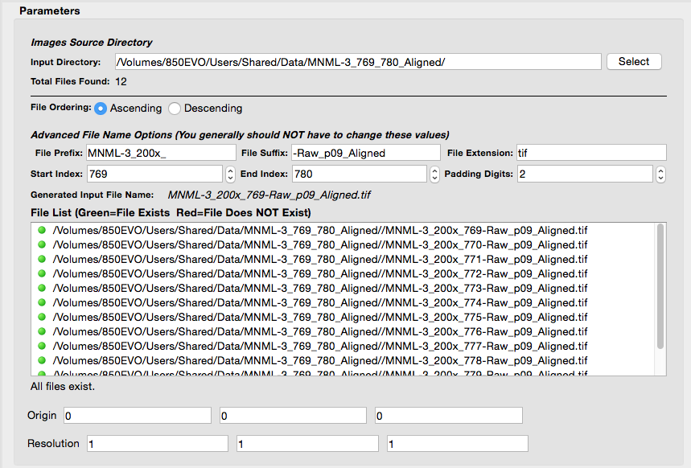
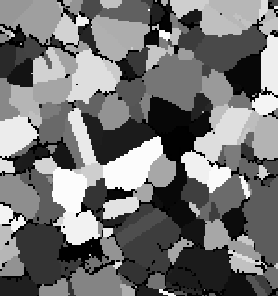
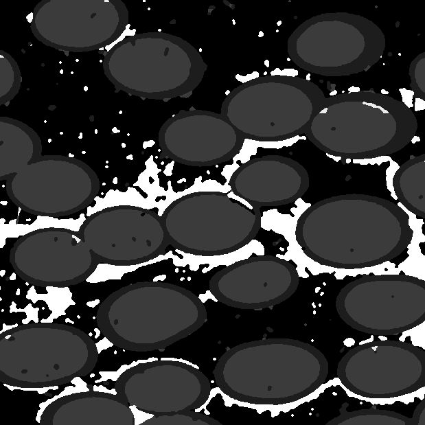
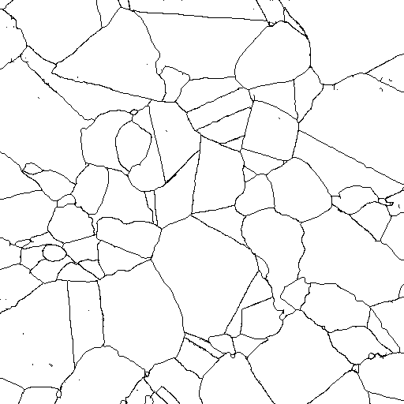

Import 3D Image Stack (ImageProcessing) {#itkimportimagestack}
=============

## Group (Subgroup) ##
IO (Input)

## Description ##
This **Filter** is used to import a stack of 2D images that represent a 3D volume.  This **Filter** makes use of ITK's classes to perform the import. In theory the filter should be able to import any type of image supported by ITK. Due to the nature of file systems and the strict lexicographical sorting of most file system APIs the user needs to enter parameters that will allow DREAM.3D to actually generate the file names and *then* check if those files actually exist. This approach guarantees that the images will be ordered correctly in the Z Direction within the 3D array.

### Visualization Notes ###

Note that due to limitations of the Xdmf wrapper, 4 component ARGB images cannot be visualized using ParaView. The only current way to solve this issue is to import the image data and then apply the [Flatten Image](flattenimage.html) **Filter**, which will convert the color data to gray scale data. The image can then be visualized in ParaView using the Xdmf wrapper.

## Importing a Stack of Images ##
This **Filter** will import a directory of sequentially numbered image files into the DREAM.3D data structure, creating a **Data Container**, **Cell Attribute Matrix**, and **Attribute Array** in the process, which the user may name. 
The user selects the directory that contains all the files to be imported then uses the additional input widgets on the **Filter** interface (_File Prefix_, _File Suffix_, _File Extension_, and _Padding Digits_) to make adjustments to the generated file name until the correct number of files is found. The user may also select starting and ending indices to import. The user interface indicates through red and green icons if an expected file exists on the file system. This **Filter** may also be used to import single images in addition to stacks of images.  
The user has the option to read the images in as an **Image Geometry** or a **Rectilinear Grid Geometry**.  If the user chooses **Image Geometry**, then the origin and resolution of the imported images must be entered.  The resolution (or size of the **Cells**) is the same for all **Cells** in this case.  If the user chooses **Rectilinear Grid Geometry**, then a file path to a file that lists the *bounds* of **Cells** in the X, Y and Z directions must be provided.  The format of the file is provided below. Note that the *bounds* array for each direction will be the number of **Cells** in that direction plus 1 (i.e., a 100x90x80 **Cell** dataset will have 101x91x81 *bounds* values).

	# Comment line
	# Comments can start with the '#' character
	X_COORDINATES [number of X coordinates] 
	x0 x1 ... x(nx-1)
	Y_COORDINATES [number of Y coordinates] 
	y0 y1 ... y(ny-1)
	Z_COORDINATES [number of Z coordinates] 
	z0 z1 ... z(nz-1)
	
-----

@image latex ImportImageStackGUI.png "Import Image Stack User Interface" width=6in

## Example Stack Import ##

	MNML-3_200x_769-Raw_p09_Aligned.tif
	MNML-3_200x_770-Raw_p09_Aligned.tif
	MNML-3_200x_771-Raw_p09_Aligned.tif
	MNML-3_200x_772-Raw_p09_Aligned.tif
	MNML-3_200x_773-Raw_p09_Aligned.tif
	MNML-3_200x_774-Raw_p09_Aligned.tif
	MNML-3_200x_775-Raw_p09_Aligned.tif
	MNML-3_200x_776-Raw_p09_Aligned.tif
	MNML-3_200x_777-Raw_p09_Aligned.tif
	MNML-3_200x_778-Raw_p09_Aligned.tif
	MNML-3_200x_779-Raw_p09_Aligned.tif
	MNML-3_200x_780-Raw_p09_Aligned.tif

| Parameter | Value |
|---------------|---------|
| File Prefix | MNML-3_200x_ |
| File Suffix | -Raw_p09_Aligned |
| File Extension | tif |
| Start Index | 769 |
| End Index | 780 |
| Padding Digits | 3 |

-----

DREAM.3D contains numerous tools to modify, analyze and segment generic image data.  If your images are already pre-processed so that they are segmented into specific regions, DREAM.3D may also be able to work with the image data and produce meaningful results. Three categories of images that DREAM.3D can handle include the following:

-----

## Category 1 Image ##

The regions of the image that represent an **Ensemble** or **Feature** each have a unique identifier such as a grayscale value or unique RGB value.

@image latex Type1.png "Category 1 Image" width=6in

-----

## Category 2 Image ##

There are regions in the image that represent **Features**, where each region has a unique identifier but there are multiple regions with the same identifier.

@image latex Type2.png "Category 2 Image" width=6in

-----

## Category 3 Image ##

Each **Feature** is traced out via another pixel identifier so that **Feature** boundaries are "black" and each **Feature** is "white". This type of image is commonly referred to as a *binary* image.

@image latex Type3.png "Category 3 Image" width=6in

-----

Note that the above categories represent a small subset of the kinds of images DREAM.3D can process.  In general, any kind of multi-dimensional data can be stored and analyzed by DREAM.3D.

## Parameters ##
See Description

## Required Geometry ##
Not Applicable

## Required Objects ##
None

## Created Objects ##

| Kind | Default Name | Type | Component Dimensions | Description |
|------|--------------|------|----------------------|-------------|
| **Data Container** | ImageDataContainer | N/A | N/A | Created **Data Container** name with an **Image Geometry** |
| **Attribute Matrix** | CellData | Cell | N/A | Created **Cell Attribute Matrix** name  |
| **Cell Attribute Array**  | ImageData | uint8_t| (n) | **Attribute Array** for the imported image data. The dimensionality of the array depends on the kind of image read: (1) for grayscale, (3) for RGB, and (4) for ARGB |

## License & Copyright ##

Please see the description file distributed with this **Plugin**

## DREAM.3D Mailing Lists ##

If you need more help with a **Filter**, please consider asking your question on the [DREAM.3D Users Google group!](https://groups.google.com/forum/?hl=en#!forum/dream3d-users)

